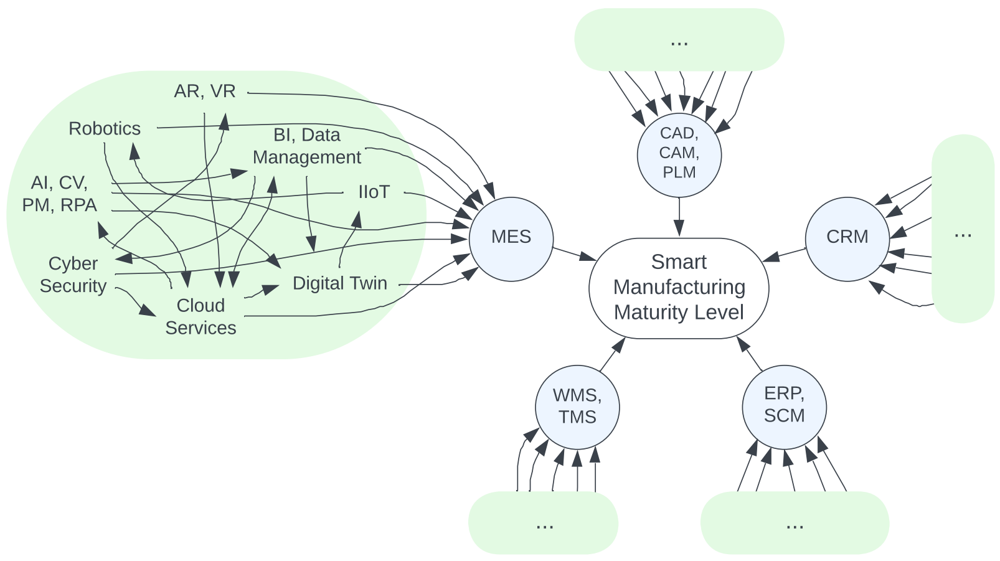

# FCM-based Maturity Model for Smart Manufacturing 

Implementation of a FCM-based Maturity Model for Smart Manufacturing focusing on IT systems and key enabling technologies as drivers. The map assesses (running the FCM) the level of smart manufacturing of a company to capture the current state of digitization (As Is) and to suggest (via Genetic Algorithm) paths for digital growth (To Be).




## Getting Started

- Create a new [conda](https://docs.anaconda.com/free/miniconda/) environment:
    ```shell
    conda create -n pyfcm python=3.10
    conda activate pyfcm
    ```

- Install the dependencies:
    ```shell
    pip install -r requirements.py
    ```

## Run the code

- Define the activation levels (AL) of each technology (node) inside the [cases](cases) folder - [follow below instructions](#define-al-for-a-new-case). Or use one of the cases already available `[low, medium, high, mix]`.

- To run the FCM (inference analysis) you need to pass the `<case_name>` as argument:
    ```shell
    python FCM_class.py <case_name>
    ```

- To run what-if analysis (genetic algorithm) you need to pass the `<target_value>` you want to reach (use `[VL, L, M, H, VH] = [neutral, very low, low, medium, high, very high]`) and the `<case_name>` as arguments:
    ```shell
    python GA_class.py <target_value> <case_name>
    ```

### Define AL for a new case

- Create a new folder in [cases](cases).
- Create a new file `0_al.csv` for the AL of the main FCM with the following data.
    ```csv
    NA,1
    NA,2
    NA,3
    NA,4
    NA,5
    NA,0
    ```
- Create five new files `X_al.csv` for `X=[1,5]={1 = "CAD,CAM,PLM", 2="CRM", 3="ERP,SCM", 4="WMS,TMS", 5="MES"}` to define the AL of each technology of each IT system. Linguistic terms used available are `[NA, VL, L, M, H, VH] = [neutral, very low, low, medium, high, very high]`. The concept linked to the main FCM, the one in $(row=0,column=0)$ must have `NA` value. Below an example:
    ```csv
    NA,0
    L,0
    M,0
    H,0
    L,0
    L,0
    M,0
    ```
    To check the technologies linked to each node, have a look at the `.json` files in [model](model).
- Put the new files (there should be 6 new files) in the folder you created previously.

### How to run the experiments

#### Graph theory analyses
In order to show results of the graph theory analyses:
```shell
cd evaluation
python eval_structure.py
```

#### FCM inference analysis
In order to plot and run results of the FCM inference analyses:
```shell
cd evaluation
python eval_fcm.py
```

#### GA analysis
In order to plot and run results of the GA analysis:
```shell
cd evaluation
python eval_ga.py
```

## License
Distributed under the MIT License. See [LICENSE](LICENSE) for more information.